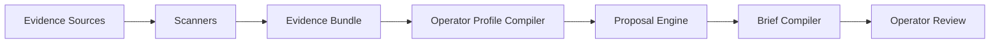
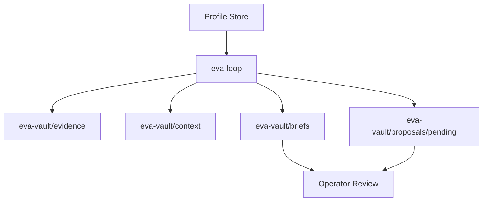

# EVA Architecture

EVA is an evidence and verification layer for agent runtimes. It converts durable runtime records into evidence bundles, compiles an operator-facing view of system health, and drafts proposals that can be reviewed before any change is made.

## Architecture goals

- Make agent-system operations inspectable from durable records.
- Keep the core package portable and independent of one runtime.
- Preserve a proposal-only safety boundary.
- Use repeatable local checks instead of implicit trust in live deployments.
- Produce artifacts that can be reviewed, archived, diffed, and tested.

## Non-goals

- EVA is not a self-modifying agent.
- EVA is not a real-time observability backend in v0.
- EVA is not tied conceptually to Hermes, even though Hermes is the first adapter.
- EVA does not publish telemetry to external services.
- EVA does not replace operator judgment or approval.

## Design principles

- **proposal-only:** EVA drafts proposals; it does not apply them.
- **read-mostly:** source profile stores are scanned, not mutated.
- **evidence-backed:** proposals should cite durable observations and avoid one-off conclusions.
- **adapter-separated:** runtime-specific concerns live behind adapter docs and templates.
- **portable by default:** defaults use home-relative paths and environment variables.
- **no live daemon in v0:** periodic/manual scans over durable logs are the default.

## Conceptual architecture

```text
Evidence Sources
  → Scanners
  → Evidence Bundle
  → Operator Profile Compiler
  → Proposal Engine
  → Brief Compiler
  → Operator Review
```

### Component view



Evidence sources are durable files or databases from an agent runtime. Scanners normalize those sources into JSON-like summaries. The compiler turns the combined evidence into an operator profile. The proposal engine creates pending recommendations. The brief compiler creates a human-readable summary.

## Runtime/data-flow architecture

```text
Agent Runtime Profile Stores
  → eva.loop
  → eva-vault/{evidence,context,proposals,briefs,health}
  → scheduled/manual delivery
```

### Runtime flow view



In write mode, `eva-loop` creates or updates vault artifacts. In strict dry-run mode (`--no-write`), it computes the same high-level bundle without creating or modifying files.

## Module map

- `eva.common` — shared path constants, time helpers, atomic file writers, vault setup.
- `eva.settings` — default thresholds and optional `context/settings.json` overrides.
- `eva.scanners.scan_memory` — memory and profile-note scanning.
- `eva.scanners.scan_sessions` — SQLite session scanning and repeated-signal extraction.
- `eva.scanners.scan_skills` — skill inventory, size, staleness, and duplicate checks.
- `eva.scanners.scan_configs` — profile config drift checks.
- `eva.compilers.compile_profile` — operator profile compilation from combined evidence.
- `eva.compilers.compile_brief` — concise human brief compilation.
- `eva.proposers.propose_patches` — pending proposal generation.
- `eva.loop` — end-to-end orchestration and CLI entrypoint.

## Data contracts

### Scan bundle schema overview

A combined scan bundle contains:

- `scanner`: normally `combined` for the loop output.
- `timestamp`: UTC timestamp.
- `memory`, `sessions`, `skills`, `configs`: scanner-specific dictionaries.
- `operator_profile`: compiled summary.
- `proposal_summary`: generated proposals and written proposal paths.
- `brief`: markdown brief in non-JSON contexts.

Scanner internals are intentionally plain dictionaries so adapters can evolve without a schema migration framework. Public docs describe stable top-level fields, not every internal diagnostic key.

### Operator profile schema overview

The operator profile is a JSON-compatible dictionary containing generated timestamps, evidence-derived summaries, and prioritized signals. The corresponding markdown version is designed for human review.

### Proposal schema overview

Pending proposals are JSON-compatible records that include an identifier, title, rationale, confidence or priority where available, evidence references where available, and a manual review disposition. A proposal is not an action.

### Vault layout

```text
eva-vault/
  context/
    settings.json
    operator-profile.json
    operator-profile.md
  evidence/
    corrections.jsonl
    failures.jsonl
    successes.jsonl
  proposals/
    pending/
    applied/
    rejected/
  briefs/
    latest-scan.json
    latest-brief.md
  health/
```

The vault is generated runtime state. It should normally be outside the source repository.

## Adapter boundary

### Core package expectations

The core package expects filesystem-readable evidence sources and a writable vault path when write mode is enabled. It should avoid runtime-specific credentials, messaging assumptions, or local profile names.

### Hermes adapter responsibilities

The Hermes adapter supplies conventions for locating Hermes profile stores, interpreting common profile artifacts, and scheduling EVA scans from a Hermes profile. Adapter files under `adapters/hermes/` are committed templates, not live runtime state.

### Future adapters

Future adapters can provide scanners for other runtimes while preserving the same conceptual pipeline: scan durable evidence, compile context, propose changes, and brief the operator.

## Scheduling model

The v0 scheduling model is daily or manual. A scheduler can invoke `eva-loop` with explicit paths and deliver the resulting brief through a local channel. EVA does not need a live node by default because durable logs and profile stores are sufficient for the initial evidence loop.

Future trigger layers may support event-driven scans or live tailing, but those modes should preserve the same proposal-only boundary and degraded-mode reporting.

## Failure and degraded-mode behavior

A scanner should report degraded or partial data rather than silently pretending complete coverage. Missing profile directories, unreadable databases, malformed settings, and scanner exceptions should be surfaced in evidence or health output without printing secret values.

## Security and privacy boundaries

- Source profile stores are read-only inputs.
- Vault artifacts may contain derived operational evidence and should be treated as private by default.
- Secret values should never be printed in diagnostics.
- Public examples must use synthetic data.
- Publication gates should scan for local paths, credentials, live profile state, and generated vault artifacts.

## Future extension points

- Additional runtime adapters.
- Stronger JSON schemas for bundle/profile/proposal artifacts.
- Optional event-driven scanning.
- Richer proposal ranking.
- UI or dashboard layers that read the vault without changing the core proposal-only model.
